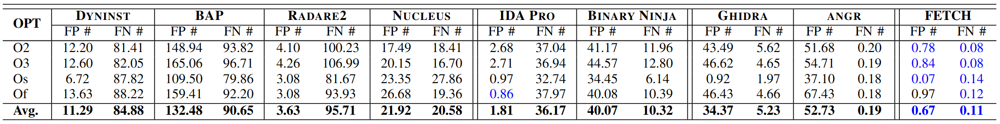

# Function Detection
- Control flow
  - Recursive descent

    > Results from recursive descent are highly accurate, but there are several limitations: handling indirect control flow constructs, disconnected functions, and tail call function identification.

  - Call target analysis

    > This analysis phase sequentially disassembles the unknown regions in the search space while aggregating all potential call targets. For our purposes, a call target is the destination of a call instruction as returned from the architecture. Once complete, the call targets are ordered by the number of cross-references in descending order and handed off to the recursive descent algorithm for further analysis.

  - Control flow graph analysis
    - Nucleus[^andriesseCompilerAgnosticFunctionDetection2017]

    > Compilers typically use different control-flow constructs for interprocedural control-flow versus intraprocedural control-flow. The general algorithm for the CFG recovery is to perform a linear disassembly of the unknown regions in the search space creating basic blocks. Then connect the basic blocks into groupings and group the basic blocks based on intraprocedural control-flow constructs. The basic block groupings become candidate functions which undergo some additional analysis to find the possible entry point.

  - Tail call analysis

- Exceptions
  - FETCH[^pangOptimalUseException2021] ([GitHub](https://github.com/ruotongyu/FETCH))

- CET IBT[^kimHowdSecurityBenefit2022]

- Signature
  - Function prologue and epilogue
  - Binary Ninja
    - SigKit
    - WARP (v4.2)
  - ML
    - ByteWeight[^burketByteWeightLearningRecognize2014]
    - BBDetector[^zhuBBDetectorPreciseScalable2023]
    - MANTILLA[^carrillo-mondejarIdentifyingRuntimeLibraries2025]
    - CRF
    - Weighted prefix tree
    - ANN
      - RNN
        - Shin:RNN

    > At first glance the results of these learners look promising but they are often biased to their training set.

    很多这些都是用 GNU 套件训练和测试的，太单一了。

> A function recognition problem serves as a basis for further binary analysis and many applications. Although common challenges for function detection are well known, prior works have repeatedly claimed a noticeable result with a high precision and recall. In this paper, we aim to fill the void of what has been overlooked or misinterpreted by closely looking into the previous datasets, metrics, and evaluations with varying case studies. Our major findings are that
> - i) a common corpus like GNU utilities is insufficient to represent the effectiveness of function identification,
> - ii) it is difficult to claim, at least in the current form, that an ML-oriented approach is scientifically superior to deterministic ones like IDA or Ghidra,
> - iii) the current metrics may not be reasonable enough to measure varying function detection cases, and
> - iv) the capability of recognizing functions depends on each tool’s strategic or peculiar choice.
> 
> We perform re-evaluation of existing approaches on our own dataset, demonstrating that not a single state-of-the-art tool dominates all the others. In conclusion, a function detection problem has not yet been fully addressed, and we need a better methodology and metric to make advances in the field of function identification.[^kooLookBackFunction2021]

[Binary Ninja - Architecture Agnostic Function Detection in Binaries](https://binary.ninja/2017/11/06/architecture-agnostic-function-detection-in-binaries.html)

Implementations:
- FETCH
- Ghidra
- [Binary Ninja](../Tools/Binary%20Ninja/README.md#analysis)
  - Control flow
    - Recursive descent
    - Call target analysis
    - Control flow graph analysis
    - Tail call analysis
- IDA
  - Control flow
    - Recursive descent
  - Intentionally does not seek unused functions (e.g., from an object file at link time)[^kooLookBackFunction2021]
- Nucleus
- Angr
- Dyninst
- Radare2
- BAP

FETCH > IDA > Ghidra > Nucleus > Binary Ninja > Angr > Dyninst > Radare2 > BAP:[^pangOptimalUseException2021]  

- [F1 scores](FETCH-f1.py)
  ```
  FETCH: 0.9961
  NUCLEUS: 0.7874
  GHIDRA: 0.7755
  IDA PRO: 0.7737
  BINARY NINJA: 0.7185
  ANGR: 0.6416
  BAP: 0.2626
  DYNINST: 0.2584
  RADARE2: 0.0821
  ```

FETCH > Ghidra > IDA[^kimHowdSecurityBenefit2022]

[Binary Ninja > IDA (at least x86)](../Tools/Binary%20Ninja/README.md#analysis)


[^kimHowdSecurityBenefit2022]: Kim, H., Lee, J., Kim, S., Jung, S., & Cha, S. K. (2022). How’d Security Benefit Reverse Engineers? : The Implication of Intel CET on Function Identification. 2022 52nd Annual IEEE/IFIP International Conference on Dependable Systems and Networks (DSN), 559–566. https://doi.org/10.1109/DSN53405.2022.00061
[^pangOptimalUseException2021]: Pang, C., Yu, R., Xu, D., Koskinen, E., Portokalidis, G., & Xu, J. (2021). Towards Optimal Use of Exception Handling Information for Function Detection. 2021 51st Annual IEEE/IFIP International Conference on Dependable Systems and Networks (DSN), 338–349. https://doi.org/10.1109/DSN48987.2021.00046
[^burketByteWeightLearningRecognize2014]: Burket, J., Woo, M., & Turner, R. (2014). ByteWeight: Learning to Recognize Functions in Binary Code.
[^andriesseCompilerAgnosticFunctionDetection2017]: Andriesse, D., Slowinska, A., & Bos, H. (2017). Compiler-Agnostic Function Detection in Binaries. 2017 IEEE European Symposium on Security and Privacy (EuroS&P), 177–189. https://doi.org/10.1109/EuroSP.2017.11
[^carrillo-mondejarIdentifyingRuntimeLibraries2025]: Carrillo-Mondéjar, J., & Rodríguez, R. J. (2025). Identifying runtime libraries in statically linked linux binaries. Future Generation Computer Systems, 164, 107602. https://doi.org/10.1016/j.future.2024.107602
[^zhuBBDetectorPreciseScalable2023]: Zhu, X., Wang, J., Fang, Z., Yin, X., & Liu, S. (2023). BBDetector: A Precise and Scalable Third-Party Library Detection in Binary Executables with Fine-Grained Function-Level Features. Applied Sciences, 13(1), Article 1. https://doi.org/10.3390/app13010413
[^kooLookBackFunction2021]: Koo, H., Park, S., & Kim, T. (2021). A Look Back on a Function Identification Problem. Annual Computer Security Applications Conference, 158–168. https://doi.org/10.1145/3485832.3488018
