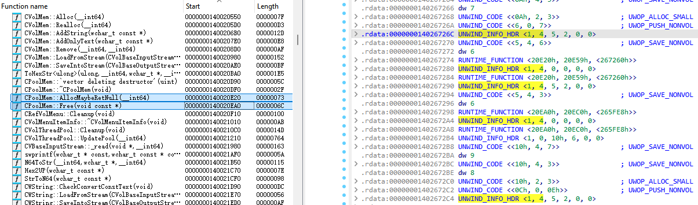

# Structured Exception Handling (SEH)
[Microsoft-specific exception handling mechanisms - Wikipedia](https://en.wikipedia.org/wiki/Microsoft-specific_exception_handling_mechanisms)

[Exception handler | Hex-Rays Docs](https://docs.hex-rays.com/9.0/user-guide/decompiler/exception-handler)

[Exception Handling using the Windows Runtime --- LLVM documentation](https://llvm.org/docs/ExceptionHandling.html#wineh)
- [LLVM: lib/CodeGen/AsmPrinter/WinException.cpp Source File](https://llvm.org/doxygen/WinException_8cpp_source.html)

[Abusing Exceptions for Code Execution, Part 2](https://billdemirkapi.me/abusing-exceptions-for-code-execution-part-2/)

[SEH Based Buffer Overflow | Red Team Notes](https://www.ired.team/offensive-security/code-injection-process-injection/binary-exploitation/seh-based-buffer-overflow)

[The Basics of Exploit Development 2: SEH Overflows | Coalfire](https://coalfire.com/the-coalfire-blog/the-basics-of-exploit-development-2-seh-overflows)

[CppCon 2018: James McNellis "Unwinding the Stack: Exploring How C++ Exceptions Work on Windows"](https://www.youtube.com/watch?v=COEv2kq_Ht8)

```cpp
void may_throw_transformed() {
  if(rand() % 2)
    throw -1;

  string s0 = "0";

  // Implicit try
  __wind {
    if(rand() % 2)
      throw 0;

    string s1 = "1";

    // Implicit try
    __wind {
      if(rand() % 2)
        throw 1;

      printf("%s %s\n",
        s0.c_str(),
        s1.c_str());
    }
    // Implicit catch
    __unwind {
      s1.~string();
    }
    s1.~string();
  }
  // Implicit catch
  __unwind {
    s0.~string();
  }
  s0.~string();
}
```

## Frame-based
[Reversing Microsoft Visual C++ Part I: Exception Handling - OpenRCE](https://www.openrce.org/articles/full_view/21)

[A Crash Course on theDepths of Win32 Structured Exception Handling, MSJ January 1997](https://web.archive.org/web/20180115191634/http://www.microsoft.com:80/msj/0197/exception/exception.aspx)

[Structured Exception Handler (SEH) example in 32 bit | mhk's blog](https://blog.mathiashabluetzel.ch/post/sehexample/)

> There are a couple of problems with this approach:
> - Because the exception information is stored on the stack, it is susceptible to buffer overflow attacks.
> - Overhead. Exceptions are, well, exceptional, which means the exception will not occur in the common case. Regardless, every time a function is entered that uses SEH, these extra instructions are executed.

```x86asm
push    0x17708
push    0x173f4
mov     eax,fs:[00000000]
push    eax
mov     fs:[00000000],esp
```

### Safe SEH
[/SAFESEH (Image has Safe Exception Handlers) | Microsoft Learn](https://learn.microsoft.com/en-us/cpp/build/reference/safeseh-image-has-safe-exception-handlers?view=msvc-170)
> `/SAFESEH` is only valid when linking for x86 targets. `/SAFESEH` isn't supported for platforms that already have the exception handlers noted. For example, on x64 and ARM, all exception handlers are noted in the PDATA.

> If `/SAFESEH` isn't specified, the linker will produce an image with a table of safe exceptions handlers if all code segments are compatible with the safe exception handling feature.

`__safe_se_handler_table`

- dumpbin: `dumpbin test.dll /loadconfig | find "xcept"`
- IDA: `___safe_se_handler_table`

[c++ - What SAFESEH:NO option actually do - Stack Overflow](https://stackoverflow.com/questions/25081033/what-safesehno-option-actually-do)

## Table-based
[The NT Insider:Exceptional Behavior - x64 Structured Exception Handling](https://www.osronline.com/article.cfm%5Earticle=469.htm)

[x64 exception handling | Microsoft Learn](https://learn.microsoft.com/en-us/cpp/build/exception-handling-x64?view=msvc-170)

[Techwiki:SEH64 - ReactOS Wiki](https://reactos.org/wiki/Techwiki:SEH64)

[Boots for Walking Backwards: Teaching pefile How to Understand SEH-Related Data in 64-bit PE Files](https://auscitte.github.io/posts/Exception-Directory-pefile)

[Exception Handling under WOW64 - Win32 apps | Microsoft Learn](https://learn.microsoft.com/en-us/windows/win32/winprog64/exception-handling-under-wow64)

`RUNTIME_FUNCTION`:
```cpp
struct RUNTIME_FUNCTION
{
  void *__ptr32 FunctionStart __offset(OFF64|RVAOFF);
  void *__ptr32 FunctionEnd __offset(OFF64|RVAOFF|PASTEND);
  void *__ptr32 UnwindInfo __offset(OFF64|RVAOFF);
};
```
> Table-based exception handling requires a table entry for all functions that allocate stack space or call another function (for example, nonleaf functions).

Usually in the `.pdata` section.

> Of course, table-based exception handling schemes have a couple of negative aspects of their own. For example, table-based schemes tend to take more space in memory than stack-based schemes. Also, while overhead in the normal execution path is reduced, the overhead it takes to process an exception is significantly higher than in frame-based approaches.

[How is table-based exception handling better than 32-bit Windows SEH? - Stack Overflow](https://stackoverflow.com/questions/54399851/how-is-table-based-exception-handling-better-than-32-bit-windows-seh)
> There's a slight performance advantage of table driven exception handling. Throwing an exception is costly anyway, but that dosn't happen often and handling a resource collapse isn't the relevant case. The performance-relevant case is when no exception is thrown and that costs nothing with table-driven EH.

Although `RUNTIME_FUNCTION` is only used on 64-bit PE, 32-bit PE also has `Exception` in `NtHeader.OptionalHeader.DataDirArray`?

### Dynamic
> For dynamically generated functions [JIT compilers], the runtime to support these functions must either use [`RtlInstallFunctionTableCallback`](https://learn.microsoft.com/en-us/windows/win32/api/winnt/nf-winnt-rtlinstallfunctiontablecallback) or [`RtlAddFunctionTable`](https://learn.microsoft.com/en-us/windows/win32/api/winnt/nf-winnt-rtladdfunctiontable) to provide this information to the operating system. Failure to do so will result in unreliable exception handling and debugging of processes.

[Factor: a practical stack language: Frame-based structured exception handling on Windows x86-64](https://factor-language.blogspot.com/2010/04/frame-based-structured-exception.html)

Applications:
- JVM

### `UNWIND_INFO`
> The unwind data info structure is used to record the effects a function has on the stack pointer, and where the nonvolatile registers are saved on the stack.
```cpp
#define UNW_FLAG_NHANDLER 0x0
#define UNW_FLAG_EHANDLER 0x1
#define UNW_FLAG_UHANDLER 0x2
#define UNW_FLAG_CHAININFO 0x4

typedef struct _UNWIND_INFO {
    UBYTE Version         : 3;
    UBYTE Flags           : 5;
    UBYTE SizeOfProlog;
    UBYTE CountOfCodes;
    UBYTE FrameRegister  : 4;
    UBYTE FrameOffset    : 4;
    UNWIND_CODE UnwindCode[1];
    union {
        // if (Flags & UNW_FLAG_EHANDLER)
        OPTIONAL ULONG ExceptionHandler;
        // else if (Flags & UNW_FLAG_UHANDLER)
        OPTIONAL ULONG FunctionEntry;
    };
    // if (Flags & UNW_FLAG_EHANDLER)
    OPTIONAL ULONG ExceptionData[];
} UNWIND_INFO, *PUNWIND_INFO;
```

### [`UNWIND_CODE`](https://learn.microsoft.com/en-us/cpp/build/exception-handling-x64?view=msvc-170#unwind-procedure)

### Chained unwind info
[Chained unwind info structures](https://learn.microsoft.com/en-us/cpp/build/exception-handling-x64?view=msvc-170#chained-unwind-info-structures)
> If the `UNW_FLAG_CHAININFO` flag is set, then an unwind info structure is a secondary one, and the shared exception-handler/chained-info address field contains the primary unwind information. This sample code retrieves the primary unwind information, assuming that unwindInfo is the structure that has the `UNW_FLAG_CHAININFO` flag set.
> 
> An `UNWIND_INFO` item that has `UNW_FLAG_CHAININFO` set can contain a `RUNTIME_FUNCTION` entry whose `UNWIND_INFO` item also has `UNW_FLAG_CHAININFO` set, sometimes called multiple shrink-wrapping. Eventually, the chained unwind info pointers arrive at an `UNWIND_INFO` item that has `UNW_FLAG_CHAININFO` cleared. This item is the primary `UNWIND_INFO` item, which points to the actual procedure entry point.

> Chained info is useful in two situations. First, it can be used for noncontiguous code segments. By using chained info, you can reduce the size of the required unwind information, because you do not have to duplicate the unwind codes array from the primary unwind info.
>
> You can also use chained info to group volatile register saves. The compiler may delay saving some volatile registers until it is outside of the function entry prolog. You can record them by having primary unwind info for the portion of the function before the grouped code, and then setting up chained info with a non-zero size of prolog, where the unwind codes in the chained info reflect saves of the nonvolatile registers. In that case, the unwind codes are all instances of `UWOP_SAVE_NONVOL`. A grouping that saves nonvolatile registers by using a PUSH or modifies the RSP register by using an additional fixed stack allocation is not supported.

- `RUNTIME_FUNCTION` with an unchained `UNWIND_INFO` must be at the start of a function?

  May be not the start of an user function, but a catch handler.

- Only used by MSVC, not Clang/rustc?

<del>

chain 只是用来多个代码块共享 unwind info 的，不一定是一个函数的不同块，比如这里就两个函数 chain 到一起了：



</del>

## C++
`ExceptionData`:
```cpp
struct FuncInfo
{
  // 0x19930522
  int magicNumber __hex;
  int maxState __dec;
  void *__ptr32 pUnwindMap __offset(OFF64|RVAOFF);
  int nTryBlocks __dec;
  void *__ptr32 pTryBlockMap __offset(OFF64|RVAOFF);
  int nIPMapEntries __dec;
  void *__ptr32 pIPtoStateMap __offset(OFF64|RVAOFF);
  int dispUnwindHelp __dec;
  void *__ptr32 pESTypeList __offset(OFF64|RVAOFF);
  int EHFlags __hex;
};
```
May or may not be present.

Also used by Rust.

### State maps
```cpp
struct IPtoStateMap
{
  void *__ptr32 pc __offset(OFF64|RVAOFF);
  int state __dec;
};
```
> Microsoft's solution to ensure that exceptions are processed in the proper sequence is simple. It assigns a "state number" to each exception-handling construct. Each exception state has a "parent" state number whose handler will be consulted if the current state's handler is unable to handle the exception. In the previous example, what we called "point 0" is assigned the state number 0, while "point 1" is assigned the state number 1. State 1 has a parent of 0. (State 0's parent is a dummy value, -1, that signifies that it has no parent.) Since `unwind` handlers always re-throw exceptions, if state 1's `unwind` handler is ever invoked, the exception handling machinery will always invoke state 0's `unwind` handler afterwards. Because state 0 has no parent, the exception machinery will re-throw the exception out of the current function. This same machinery ensures that the catch handlers for inner `try` blocks are consulted before outer `try` blocks.
>
> There is only one more piece to the puzzle: given that an exception could occur anywhere, how does the exception machinery know which exception handler should be consulted first? I.e., for every address within a function with C++ exception metadata, what is the current exception state? Microsoft C++/x64 binaries provide this information in the `IPtoStateMap` metadata tables, which is an array of address ranges and their corresponding state numbers.

[windows x64 exception data is innacurate - Issue #46803 - llvm/llvm-project](https://github.com/llvm/llvm-project/issues/46803)
- [Suspected X64 exception handler IP to state map off-by-one error - Issue #117725 - rust-lang/rust](https://github.com/rust-lang/rust/issues/117725)

### Dubbed FH4
[Making C++ Exception Handling Smaller On x64 - C++ Team Blog](https://devblogs.microsoft.com/cppblog/making-cpp-exception-handling-smaller-x64/)

## Windows
- Isn't MSVC exceptions built on top of SEH? Why there are APIs in Windows?

  Just SEH APIs.

  [Exception Handling in Windows - Microsoft Q&A](https://learn.microsoft.com/en-us/answers/questions/2110867/exception-handling-in-windows)

APIs:
- `RtlDispatchException`
- [`RtlVirtualUnwind`](#rtlvirtualunwind)
- [`RtlInstallFunctionTableCallback`](https://learn.microsoft.com/en-us/windows/win32/api/winnt/nf-winnt-rtlinstallfunctiontablecallback)
- [`RtlAddFunctionTable`](https://learn.microsoft.com/en-us/windows/win32/api/winnt/nf-winnt-rtladdfunctiontable)

### [`RtlVirtualUnwind`](https://learn.microsoft.com/en-us/windows/win32/api/winnt/nf-winnt-rtlvirtualunwind)
```rust
// XP SP1
fn RtlVirtualUnwind() {
  // If the next instruction is a return, then control is currently in
  // an epilogue and execution of the epilogue should be emulated.
  // Otherwise, execution is not in an epilogue and the prologue should
  // be unwound.
  if (NextByte[0] == RET_OP) {
    todo!()
    return NULL;
  }

  // Control left the specified function outside an epilogue. Unwind the
  // subject function and any chained unwind information.
  FunctionEntry = RtlpUnwindPrologue() {
    while todo!() {
      match UnwindOp {
        todo!()
      }
    }
  }

  // If control left the specified function outside of the prologue and
  // the function has a handler that matches the specified type, then
  // return the address of the language specific exception handler.
  // Otherwise, return NULL.
  todo!()
}
```
